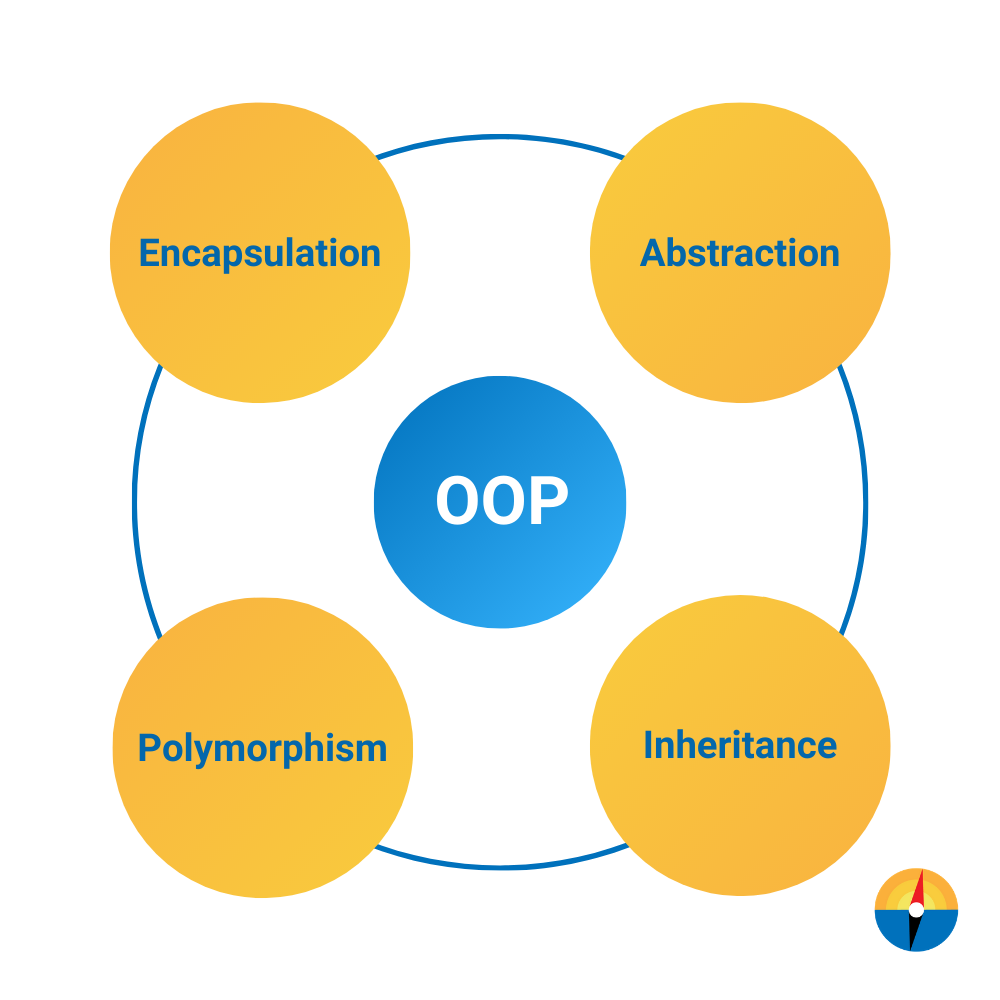

# OOP-Final-Revision

ندخل بقي علي الماده المحبوبه من الكل ال oop

مش عايزك تقلق لو حاسس نفسك تايه في الماده وحاسس الكونتنت كتير الماده مش صعبه محتاجه بس شوية تظبيط وهندله منك وتتاسس صح في الكام حاجه الاولي علشان تكون حاسس كل حاجه بتتعلمها ليه وهتستخدمها في ايه

`Programming is learned by writing programs. ― Brian Kernighan`

وزي ما عمنا brian بيقول عمرك ما هتوصل لليفل استيعاب الحاجه غير لما تجربها بايدك جهز ال ide ويلا بينا

  

هنبتدي part 1 باننا نتكلم عن ال oop والمفاهيم الاساسيه ليها بعد كده هننتقل علي part 2 ونتكلم عن solid وال design pattern

## OOP Principles

- [Introduction to oop](./oop/introduction.md)
- [inhiretence and access modefiers and polimerpysms ](./oop/inheritance-accessmodifiers.md)
- [Types of Relationships](./oop/Relationships.md)
- [Abstraction](./oop/abstraction.md)
- [SOLID Principles](./oop/solid.md)
