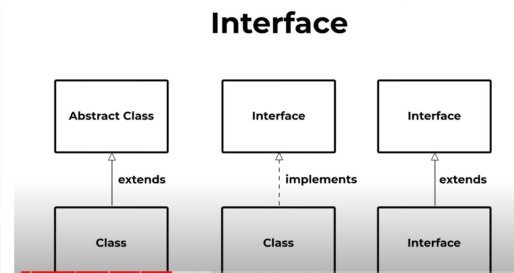
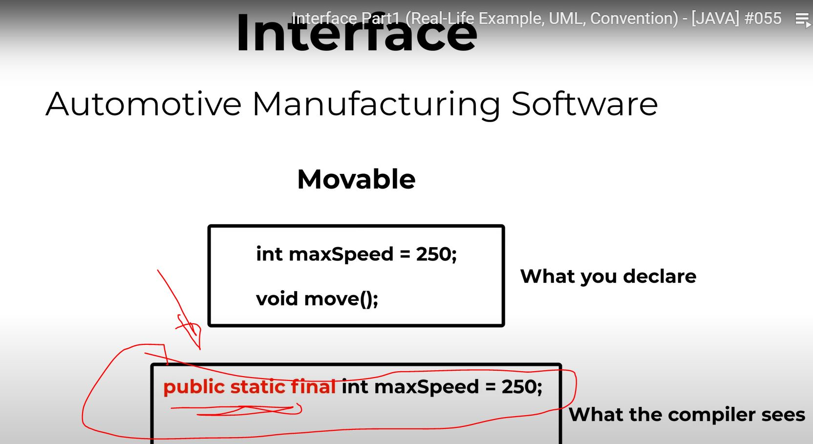
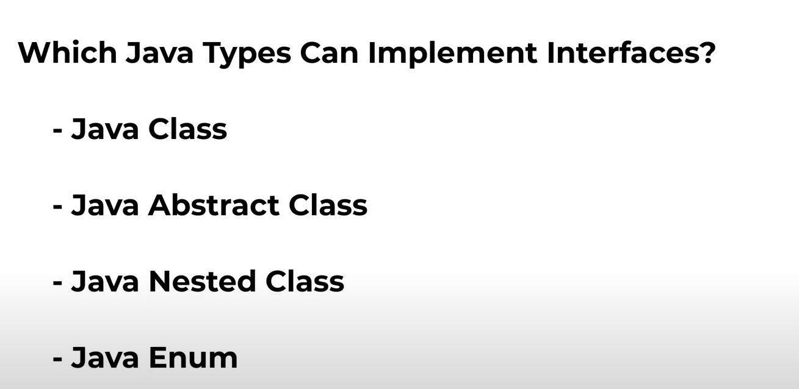

# Remember

<p align="center">
  
</p>

<p align="center">
  
</p>

<p align="center">
  
</p>

<p align="center">
  
</p>

`"The beautiful thing about learning is that no one can take it away from you." — B.B. King`

# questions (MCQs)

1. What is the primary purpose of abstraction in Java?
   A) To speed up the execution of the program
   B) To hide the implementation details from the user
   C) To increase the size of the codebase
   D) To make all methods static

**Answer: B**

2. Which of the following is true about an abstract class in Java?
   A) It can be instantiated using the `new` keyword.
   B) It must contain at least one abstract method.
   C) It cannot have any concrete methods.
   D) It can have both abstract and non-abstract methods.

**Answer: D**

3. What is the correct way to declare an abstract method in Java?
   A) `public abstract void myMethod();`
   B) `public void myMethod() {}`
   C) `private abstract void myMethod();`
   D) `public void myMethod();`

**Answer: A**

5. How many abstract classes can a single Java class extend?
   A) None
   B) One
   C) Two
   D) As many as required

**Answer: B**

6. Can an abstract class in Java have a constructor?
   A) Yes, but it cannot be called.
   B) No, abstract classes do not have constructors.
   C) Yes, it is used to initialize fields of the abstract class.
   D) No, constructors are only for concrete classes.

**Answer: C**

7. Which of the following best describes the concept of abstraction?
   A) Abstraction is the process of hiding the complex reality while exposing only the necessary parts.
   B) Abstraction is the process of making all methods final.
   C) Abstraction is the process of writing more code than necessary.
   D) Abstraction is the process of creating static methods only.

**Answer: A**

8. In Java, which keyword is used to achieve abstraction?
   A) `final`
   B) `static`
   C) `abstract`
   D) `synchronized`

**Answer: C**

9. What is the outcome of attempting to instantiate an abstract class directly in Java?
   A) A runtime exception is thrown.
   B) The object is created, but it's considered incomplete.
   C) A compile-time error occurs.
   D) The abstract class is automatically converted to a concrete class.

**Answer: C**

10. Which of the following is a characteristic of an abstract method in Java?
    A) It must have a body.
    B) It can be declared private.
    C) It must be overridden in a subclass unless the subclass is also abstract.
    D) It can only be created in interfaces, not in abstract classes.

**Answer: C**

11. What happens when an abstract class implements an interface in Java?
    A) It must provide implementations for all interface methods.
    B) It can choose to not implement any of the interface methods.
    C) It must be declared as final.
    D) It cannot contain any concrete methods.

**Answer: B**

12. Which of the following is not a valid reason to use an abstract class?
    A) To force subclasses to implement abstract methods.
    B) To provide a common template for subclasses.
    C) To hide the implementation details of certain methods.
    D) To create objects directly from the abstract class.

**Answer: D**

13. What is the output of the following Java code?

```java
abstract class Shape {
    abstract void draw();
}

class Circle extends Shape {
    void draw() {
        System.out.println("Drawing Circle");
    }
}

public class Test {
    public static void main(String[] args) {
        Shape shape = new Circle();
        shape.draw();
    }
}
```

A) Drawing Circle  
B) Drawing Shape  
C) Compilation error  
D) Runtime error

**Answer: A**

14. Which of the following is true about a Java class that implements an interface?
    A) It must declare all the interface methods as abstract.
    B) It can be declared as abstract without implementing any methods.
    C) It must provide concrete implementations for all inherited abstract methods.
    D) It can only implement one interface at a time.

**Answer: C**

16. What is the purpose of declaring a class as abstract?
    A) To prevent the instantiation of the class.
    C) To ensure the class can only have static methods.
    D) To allow the class to be instantiated multiple times.

**Answer: A**

17. Which of the following best describes an abstract method?
    A) A method that is fully implemented but cannot be called.
    B) A method that is declared without an implementation.
    C) A method that must be static.
    D) A method that is private and cannot be accessed by subclasses.

**Answer: B**

18. Can an abstract class in Java have a static method?
    A) Yes, and it can be called without creating an instance of the class.
    B) No, abstract classes cannot have static methods.
    C) Yes, but it must be overridden in the subclass.
    D) No, static methods are not allowed in object-oriented programming.

**Answer: A**

19. Which of the following is a characteristic of an interface in Java?
    A) It can contain instance variables.
    B) It can contain default methods with an implementation. lates versions in java
    C) It can contain final methods that cannot be overridden.
    D) It can contain private and protected methods.

**Answer: B**

20. What is the difference between an interface and an abstract class in Java?
    A) An interface can have instance fields, while an abstract class cannot.
    B) An abstract class can have a constructor, while an interface cannot.
    C) An interface can have non-public abstract methods, while an abstract class cannot.
    D) An abstract class can implement methods, while an interface can only declare them.

**Answer: B**

21. Which of the following is not a feature of an abstract class in Java?
    A) It can have static methods.
    B) It can have final methods.
    C) It can have private abstract methods.
    D) It can have constructors.

**Answer: C** (Abstract methods cannot be private as they need to be visible to subclasses.)

22. What is the result of declaring a class as both abstract and final in Java?
    A) The class can be instantiated.
    B) The class cannot be instantiated or extended.
    C) The class can only be extended but not instantiated.
    D) The class can be used to declare variables.

**Answer: B** (A class cannot be both abstract and final; abstract classes must be extended, and final classes cannot be extended.)

23. Which of the following is true about abstract methods in an interface in Java?
    A) They must be marked with the abstract keyword.
    B) They are implicitly public and abstract.
    D) They are implicitly private and abstract.

**Answer: B** (Methods in an interface are implicitly public and abstract unless marked with the default keyword.)

24. What is the purpose of the `abstract` keyword in Java?
    A) To indicate that a class or method is incomplete and must be completed in a subclass.
    B) To make a class or method immutable.
    C) To optimize the code for performance.
    D) To mark a class or method as deprecated.

**Answer: A** (The `abstract` keyword is used to declare an incomplete class or method that must be implemented by subclasses.)

25. Can an abstract class implement all methods of an interface in Java?
    A) Yes, and it can still remain abstract.
    B) No, it must leave at least one method unimplemented.
    C) Yes, but it then becomes a concrete class.
    D) No, abstract classes cannot implement interfaces.

**Answer: A** (An abstract class can implement all methods of an interface and still remain abstract if it has other abstract methods.)

26. What is the difference between an abstract class and a concrete class in Java?
    A) An abstract class can have instance variables, while a concrete class cannot.
    B) A concrete class can be instantiated, while an abstract class cannot.
    C) An abstract class can have constructors, while a concrete class cannot.
    D) A concrete class can have methods, while an abstract class cannot.

**Answer: B** (A concrete class is a fully implemented class that can be instantiated, unlike an abstract class.)

27. Which of the following is a valid use of an abstract class in Java?
    A) To create a fully implemented class with no need for extension.
    B) To declare a class that serves as a blueprint for other classes.
    C) To prevent other classes from inheriting from it.
    D) To ensure that a class cannot have any methods.

**Answer: B** (Abstract classes serve as blueprints for other classes that extend them.)

28. In Java, if a class extends an abstract class without implementing all abstract methods, what must it be declared as?
    A) Final
    B) Static
    C) Abstract
    D) Private

**Answer: C** (If a class does not implement all abstract methods from its superclass, it must also be declared abstract.)

29. What is enforced by declaring a method as abstract in a Java class?
    A) The method must be static.
    B) The method must provide a default implementation.
    C) The method must be implemented by any subclass.
    D) The method cannot be part of an interface.

**Answer: C** (An abstract method must be implemented by any concrete subclass.)

30. Which of the following statements is true regarding abstract classes and interfaces in Java 8 and above?
    A) Interfaces cannot have default methods with implementations.
    B) Abstract classes can have static methods with implementations.
    C) Interfaces can have static methods with implementations.
    D) Abstract classes cannot have any concrete methods.

**Answer: C** (As of Java 8, interfaces can have static methods with implementations as well as default methods.)

1. What will be the output of the following code?

```java
abstract class Vehicle {
    abstract int getWheelCount();
}

class Car extends Vehicle {
    int getWheelCount() {
        return 4;
    }
}

public class Test {
    public static void main(String[] args) {
        Vehicle vehicle = new Car();
        System.out.println(vehicle.getWheelCount());
    }
}
```

A) 0  
B) 4  
C) Compilation error  
D) Runtime error

**Answer: B**

2. Which method will be called in the following code snippet?

```java
abstract class Instrument {
    abstract String play();
}

class Guitar extends Instrument {
    String play() {
        return "Strum";
    }
}

class Violin extends Instrument {
    String play() {
        return "Bow";
    }
}

public class Orchestra {
    public static void main(String[] args) {
        Instrument i = new Guitar();
        System.out.println(i.play());
    }
}
```

A) Instrument's play  
B) Guitar's play  
C) Violin's play  
D) None, it will throw an exception

**Answer: B**

3. What is the result of attempting to compile the following code?

```java
abstract class Shape {
    abstract double area();
    abstract double perimeter();
}

class Circle extends Shape {
    private double radius;

    Circle(double radius) {
        this.radius = radius;
    }

    double area() {
        return Math.PI * radius * radius;
    }


}

public class Test {
    public static void main(String[] args) {
        Shape shape = new Circle(5);
        System.out.println(shape.area());
    }
}
```

A) Compiles and prints the area of the circle  
B) Compiles and prints an error message  
C) Compilation error due to missing implementation  
D) Runtime error

**Answer: C**

4. Which of the following code snippets correctly uses abstraction?

```java
// Snippet A
abstract class Animal {
    abstract void makeSound();
}

class Dog extends Animal {
    void makeSound() {
        System.out.println("Bark");
    }
}

// Snippet B
class Animal {
    void makeSound() {
        System.out.println("Generic sound");
    }
}

class Dog extends Animal {
    void makeSound() {
        System.out.println("Bark");
    }
}
```

A) Snippet A  
B) Snippet B  
C) Both A and B  
D) Neither A nor B

**Answer: A**

5. What will be the output of the following code?

```java
interface Drawable {
    void draw();
}

class Line implements Drawable {
    public void draw() {
        System.out.println("Line drawn");
    }
}

class Test {
    public static void main(String[] args) {
        Drawable d = new Line();
        d.draw();
    }
}
```

A) Line drawn  
B) Drawable drawn  
C) Compilation error  
D) Runtime error

**Answer: A**

6. What is the issue with the following abstract class definition?

```java
abstract class Calculator {
    abstract int add(int a, int b) { return a + b; }
    abstract int subtract(int a, int b) { return a - b; }
}
```

A) Abstract methods cannot have a body  
B) Calculator should be an interface, not an abstract class  
C) The methods should not be abstract  
D) There is no issue; the code is correct

**Answer: A**

7. What will happen if you try to compile and run the following Java code?

```java
abstract class Writer {
    abstract void write();
}

class Pen extends Writer {
    void write() {
        System.out.println("Write with a pen");
    }
}

class Pencil extends Writer {
    void write() {
        System.out.println("Write with a pencil");
    }
}

public class Test {
    public static void main(String[] args) {
        Writer w = new Pen();
        w.write();
    }
}
```

A) Write with a pen  
B) Write with a pencil  
C) Compilation error  
D) Runtime error

**Answer: A**

8. Which of the following statements is true for the given code?

```java
abstract class Device {
    abstract void turnOn();
}

class Smartphone extends Device {
    void turnOn() {
        System.out.println("Smartphone turning on");
    }
}

class Television extends Device {
    void turnOn() {
        System.out.println("Television turning on");
    }
}
```

A) Device can be instantiated.  
B) Smartphone and Television must implement the turnOn method.  
C) The turnOn method in Device can be private.  
D) The code will not compile unless Device is an interface.

**Answer: B**

9. What is the output of the following code?

```java
abstract class Player {
    abstract String play();
}

class Guitarist extends Player {
    String play() {
        return "Guitar";
    }
}

class Drummer extends Player {
    String play() {
        return "Drums";
    }
}

public class Band {
    public static void main(String[] args) {
        Player p = new Drummer();
        System.out.println(p.play());
    }
}
```

A) Guitar  
B) Drums  
C) Compilation error  
D) Runtime error

**Answer: B**

10. What is the result of the following code snippet?

```java
abstract class Food {
    abstract String taste();
}

class Pizza extends Food {
    String taste() {
        return "Delicious";
    }
}

class Salad extends Food {
    String taste() {
        return "Healthy";
    }
}

public class Dinner {
    public static void main(String[] args) {
        Food f = new Salad();
        System.out.println(f.taste());
    }
}
```

A) Delicious  
B) Healthy  
C) Compilation error  
D) Runtime error

**Answer: B**
