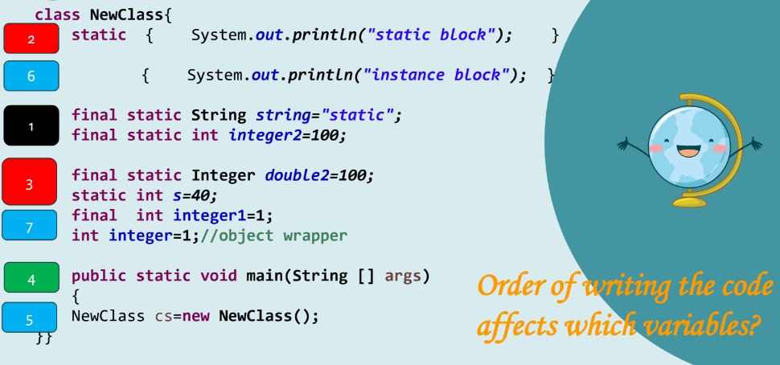

# محتاجك تتفرج علي الفيديوهين دول قبل ما نبتدي نحل

[Part 1](https://youtu.be/vnzteHmCIg0?si=PhznmvrDmHlYvmZm)

[Part 2](https://youtu.be/bI1vqMrIGlQ?si=_dGMFV5KJbscfuOX)

# Remember

<p align="center">
  
</p>

[Uml diagram](https://youtu.be/bI1vqMrIGlQ?si=_dGMFV5KJbscfuOX)

بعد شوية اساله هحطلكم لينكات شرح لل Polymorphism

`"The more that you read, the more things you will know. The more that you learn, the more places you'll go." — Dr. Seuss`

<p align="center">
  
</p>

questions (MCQs)

````markdown
1. What is the result of compiling and running the following Java code?

```java
class SuperClass {
    static String greeting = "Good morning";
    static String getGreeting() {
        return greeting;
    }
}

public class SubClass extends SuperClass {
    static String greeting = "Good evening";

    public static void main(String[] args) {
        SuperClass superClass = new SubClass();
        System.out.println(superClass.getGreeting());
    }
}
```
````

A) Good morning  
B) Good evening  
C) Compilation error  
D) Runtime error

**Answer: A**

2. Which statement is true about static blocks in Java?

A) They can only be declared inside methods.  
B) They are executed at compile time.  
C) They are executed when the class is loaded into the JVM.  
D) They can be called directly using the class instance.

**Answer: C**

3. What is the purpose of access modifiers in Java?
   A) To provide a way to structure the code logically.  
   B) To restrict access to the members of a class.  
   C) To enhance the performance of the program.  
   D) To declare constants.

**Answer: B**

4. Which access modifier would you use to make a member accessible only within its own class?
   A) public  
   B) private  
   C) protected  
   D) default

**Answer: B**

5. Consider the following code snippet. What will be the output?+ debugger this code and write order of excution

```java
class StaticDemo {
    static int count = 0;

    StaticDemo() {
        count++;
    }

    static {
        System.out.println("Static block executed.");
    }

    {
        System.out.println("Instance block executed.");
    }
}

public class Main {
    public static void main(String[] args) {
        StaticDemo obj1 = new StaticDemo();
        StaticDemo obj2 = new StaticDemo();
        System.out.println(StaticDemo.count);
    }
}
```

A) Static block executed.  
 Instance block executed.  
 Instance block executed.  
 2  
B) Static block executed.  
 Instance block executed.  
 2  
C) Instance block executed.  
 Instance block executed.  
 2  
D) Static block executed.  
 Instance block executed.  
 Instance block executed.  
 Static block executed.  
 2

**Answer: A**

1 Class Loading:

When the Main class is loaded and its main method is invoked, the StaticDemo class is loaded because it is referenced in main.
Static Initialization of StaticDemo:

2 The static fields and static initializer blocks of StaticDemo are executed in the order they appear.
StaticDemo has a static field count initialized to 0.
The static block in StaticDemo is executed, printing "Static block executed.".

3Execution of main Method:

The main method is invoked.

4 Creation of StaticDemo Instances:

StaticDemo obj1 = new StaticDemo();
When obj1 is created, the instance initializer block is executed, printing "Instance block executed.".
Then, the constructor is executed, incrementing count by 1.
StaticDemo obj2 = new StaticDemo();
When obj2 is created, the instance initializer block is executed again, printing "Instance block executed.".
Then, the constructor is executed, incrementing count by 1 again.
5 Printing count:

System.out.println(StaticDemo.count); prints the value of count, which is 2

6. In Java, which keyword is used to inherit a class?
   A) super  
   B) this  
   C) extends  
   D) implements

**Answer: C**

7. What will be the output of the following code?debugger this code and write order of excution

```java
class Parent {
    protected static int count = 0;

    static {
        count++;
    }
}

public class Child extends Parent {
    static {
        count++;
    }

    public static void main(String[] args) {
        System.out.println(Child.count);
    }
}
```

A) 0  
B) 1  
C) 2  
D) Compilation error

**Answer: C**

Loading Classes: When the Main class is loaded, the Parent class is also loaded because Main extends Parent.
Initialization of Static Members:
Static fields and static initializers are executed in the order they appear in the class definition.
Static fields in the superclass are initialized first, followed by the static initializers in the superclass, then the static fields in the subclass, and finally the static initializers in the subclass.

8. Which of the following is not a valid Java access modifier?
   A) transient  
   B) public  
   C) protected  
   D) private

**Answer: A**

9. What is the correct order of initialization in Java?

| Items            | Sorted Items |
| ---------------- | ------------ |
| Static blocks    |
| Static variables |
| Main             |
| Constructor      |
| Instance block   |

<!-- ``` &#8203;:citation[oaicite:0]{index=0}&#8203; -->

<p align="center">
  
</p>

ans )
Items | Sorted Items
----------------------|----------------
Static blocks | Static variables
Static variables | Static blocks
Main | Main method
Constructor | Instance block
Instance block | Constructor

````​:citation[oaicite:0]{index=0}​


example for prev question

try debugger this code

```java
class StaticDemo {
    static int count = 0;

    // Static block
    static {
        System.out.println("Static block executed.");
    }

    // Instance initializer block
    {
        System.out.println("Instance block executed.");
    }

    // Constructor
    StaticDemo() {
        System.out.println("Constructor executed.");
        count++;
    }
}

public class Main {
    public static void main(String[] args) {
        System.out.println("Main method executed.");
        StaticDemo obj1 = new StaticDemo();
        StaticDemo obj2 = new StaticDemo();
        System.out.println("Count: " + StaticDemo.count);
    }
}
````

10. What is the output of the following code?

```java
class Base {
    static {
        System.out.println("Base static block");
    }

    {
        System.out.println("Base instance block");
    }

    Base() {
        System.out.println("Base constructor");
    }
}

public class Derived extends Base {
    static {
        System.out.println("Derived static block");
    }

    {
        System.out.println("Derived instance block");
    }

    Derived() {
        System.out.println("Derived constructor");
    }

    public static void main(String[] args) {
        new Derived();
    }
}
```

A) Base static block  
 Derived static block  
 Base instance block  
 Base constructor  
 Derived instance block  
 Derived constructor  
B) Derived static block  
 Base static block  
 Base instance block  
 Derived instance block  
 Base constructor  
 Derived constructor  
C) Base static block  
 Derived static block  
 Derived instance block  
 Derived constructor  
 Base instance block  
 Base constructor  
D) Derived static block  
 Base static block  
 Derived instance block  
 Base instance block  
 Base constructor  
 Derived constructor

**Answer: A**

# Polymorphism

[Part 1](https://youtu.be/bI1vqMrIGlQ?si=Px4-hfU7uFEzmvsR)

[Part 2](https://youtu.be/kBpkPU0zkNk?si=TJYQMjl18nygPQ_K)

[Part 3](https://youtu.be/kBpkPU0zkNk?si=CFzLc9UIuorwzfPa)

اتفرجت ؟ يلا بينا نكمل

````markdown
11. What will happen if a superclass method is declared as `private` and the subclass tries to override it?
    A) The subclass version of the method will be called.
    B) The superclass version of the method will be called.
    C) A compilation error will occur.
    D) The subclass method is considered a new method, not an override.

**Answer: D**

12. Which of the following is true about a `final` class in Java?
    A) It cannot be extended.
    B) It cannot have methods.
    C) It cannot have static blocks.
    D) It cannot have member variables.

**Answer: A**

13. If a method is declared as `protected` in a superclass, which of the following is true?
    A) It can be accessed from any class.
    B) It can only be accessed within the same package.
    C) It can be accessed from subclasses in any package.
    D) It can be accessed only if the superclass and subclass are in the same file.

**Answer: C**

14. What is the output of the following code snippet?

```java
class A {
    private int method() {
        return 0;
    }
}

class B extends A {
    public int method() {
        return 1;
    }
}

public class Test {
    public static void main(String[] args) {
        A obj = new B();
        System.out.println(obj.method());
    }
}
```
````

A) 0  
B) 1  
C) Compilation error  
D) Runtime error

**Answer: C**

15. Which keyword is used to prevent method overriding in Java?
    A) static  
    B) final  
    C) abstract  
    D) private

**Answer: B**

16. What is the result of the following code?

```java
class Parent {
    String message = "parent";
    static void print() {
        System.out.println("Parent");
    }
}

class Child extends Parent {
    String message = "child";
    static void print() {
        System.out.println("Child");
    }
}

public class Test {
    public static void main(String[] args) {
        Parent obj = new Child();
        System.out.println(obj.message);
        obj.print();
    }
}
```

A) parent  
 Parent  
B) child  
 Child  
C) parent  
 Child  
D) child  
 Parent

**Answer: A**

17. In Java, which of these can be inherited to a subclass located in a different package?
    A) Default member variables
    B) Private member variables
    C) Protected member variables
    D) None of the above

**Answer: C**

19. What is the access level of a member variable declared without any access modifiers?
    A) Private
    B) Public
    C) Protected
    D) Package-private

**Answer: D**

20. Which of the following is true about static methods in Java?
    A) They can be overridden like instance methods.
    B) They can only be declared in static classes.
    C) They can access instance variables directly.
    D) They cannot be overridden because they are not dispatched on the instance at runtime.

**Answer: D**

````markdown
11. What will happen if you try to compile and run the following Java code?

```java
class Base {
    private static void display() {
        System.out.println("Base display");
    }
}

public class Derived extends Base {
    public static void display() {
        System.out.println("Derived display");
    }

    public static void main(String[] args) {
        Derived.display();
    }
}
```
````

A) Base display  
B) Derived display  
C) Compilation error  
D) No output

**Answer: B**

12. Which of the following is true about method overriding in Java?
    A) Overridden methods must have a more restrictive access modifier than the original method.  
    B) Overridden methods must have the same return type as the original method.  
    C) Overridden methods can throw any exceptions, regardless of the original method's exceptions.  
    D) Static methods can be overridden to support polymorphism.

**Answer: B**

13. Given the following Java code, which statement is correct?

```java
class A {
    void foo() { System.out.println("A"); }
}

class B extends A {
    void foo() { System.out.println("B"); }
}

class C extends B {
    private void foo() { System.out.println("C"); }
}
```

A) Class C correctly overrides the foo() method from class B.  
B) Class C's foo() method will cause a compilation error due to more restrictive access.  
C) Class C's foo() method is an example of method hiding.  
D) Class C's foo() method will be called when using polymorphism with an A reference to a C object.

**Answer: B**

14. What is the output of the following Java program?

```java
class Animal {
    static void doStuff() {
        System.out.println("Animal");
    }
}

class Dog extends Animal {
    static void doStuff() {
        System.out.println("Dog");
    }

    public static void main(String[] args) {
        Animal[] animals = {new Animal(), new Dog(), new Animal()};
        for(Animal a : animals) {
            a.doStuff();
        }
    }
}
```

A) Animal  
 Dog  
 Animal  
B) Animal  
 Animal  
 Animal  
C) Dog  
 Dog  
 Dog  
D) Compilation error

**Answer: B**

15. Which of the following statements is true about static methods and polymorphism?
    A) Static methods are polymorphic and can be overridden.  
    B) Static methods are not polymorphic and cannot be overridden.  
    C) Static methods can be overridden but not overloaded.  
    D) Static methods can be overloaded but not overridden.

**Answer: D**

16. What is the result of the following code snippet?

```java
class Parent {
    String name = "Parent";

    void printName() {
        System.out.println(name);
    }
}

class Child extends Parent {
    String name = "Child";

    void printName() {
        System.out.println(name);
    }
}

public class Test {
    public static void main(String[] args) {
        Parent p = new Child();
        p.printName();
    }
}
```

A) Parent  
B) Child  
C) Compilation error  
D) Runtime error

**Answer: B**

17. Which of the following is not a valid use of the 'final' keyword in Java?
    A) To prevent a class from being subclassed.  
    B) To prevent a method from being overridden.  
    C) To define a constant variable.  
    D) To ensure a variable can be changed.

**Answer: D**

18. In Java, which of the following is not a type of inheritance?
    A) Single Inheritance  
    B) Multiple Inheritance  
    C) Multilevel Inheritance  
    D) Hierarchical Inheritance

**Answer: B**

19. What is the output of the following Java code?

```java
class Alpha {
    static String s = " ";
    protected Alpha() {
        s += "alpha ";
    }
}

class SubAlpha extends Alpha {
    private SubAlpha() {
        s += "sub ";
    }
}

public class SubSubAlpha extends Alpha {
    private SubSubAlpha() {
        s += "subsub ";
    }

    public static void main(String[] args) {
        new SubSubAlpha();
        System.out.println(s);
    }
}
```

A) alpha sub subsub  
B) sub subsub  
C) alpha subsub  
D) subsub

**Answer: C**

20. Which of the following is true about the 'super' keyword in Java?
    A) It is used to call the superclass version of an overridden method.  
    B) It can only be used to call constructors of the superclass.  
    C) It refers to the immediate parent class object.  
    D) It is used to access static methods of the superclass.

**Answer: A**

````markdown
21. What is the output of the following Java code?

```java
class A {
    private void method() {
        System.out.println("Class A");
    }
}

class B extends A {
    public void method() {
        System.out.println("Class B");
    }
}

public class Test {
    public static void main(String[] args) {
        A obj = new B();
        // obj.method(); // Uncomment to test
    }
}
```
````

A) Class A  
B) Class B  
C) Compilation error  
D) Runtime error

**Answer: C** (The method in class A is private and cannot be accessed or overridden by class B.)

22. In Java, which of the following is true about a final class?
    A) It can be extended.  
    B) It can extend other classes.  
    C) It cannot be extended.  
    D) It cannot implement interfaces.

**Answer: C** (A final class cannot be subclassed.)

23. Which of the following statements is true about the static keyword in Java?
    A) Static methods can be overridden to support dynamic polymorphism.  
    B) Static methods belong to the class, not instances of the class.  
    C) Static methods can access non-static members directly.  
    D) Static blocks are executed every time an object is created.

**Answer: B** (Static methods belong to the class and cannot access instance variables without an object.)

25. Which access modifier makes a member accessible only to the classes in the same package and subclasses in other packages?
    A) private  
    B) default  
    C) protected  
    D) public

**Answer: C** (The protected access modifier allows package-private access and also allows access in subclasses.)

السؤال الجاي هسال عليه الدكتور علشان بيطلعلي نتيجه مختلفه

26. What is the result of the following code snippet?

```java
class Parent {
    static String name = "Parent";
}

class Child extends Parent {
    static {
        name = "Child";
    }
}

public class Test {
    public static void main(String[] args) {
        System.out.println(Parent.name);
    }
}
```

A) Parent  
B) Child  
C) Compilation error  
D) Runtime error

**Answer: B** (The static block in Child is executed when the class is loaded, changing the value of name.)

27. Which of the following is not a valid Java access modifier?
    A) synchronized  
    B) public  
    C) private  
    D) protected

**Answer: A** (Synchronized is not an access modifier; it's a keyword used to define a block or method as synchronized.)

29. What is the purpose of the 'super' keyword in Java?
    A) To call a superclass constructor.  
    B) To access a superclass method that has been overridden.  
    C) Both A and B.  
    D) None of the above.

**Answer: C** (The 'super' keyword can be used for both calling a superclass constructor and accessing an overridden superclass method.)

30. Which of the following is true about method overloading and method overriding in Java?
    A) Method overloading is a compile-time polymorphism, and method overriding is a runtime polymorphism.  
    B) Method overloading and method overriding both occur at runtime.  
    C) Method overloading occurs at runtime, and method overriding occurs at compile-time.  
    D) Method overloading and method overriding both occur at compile-time.

**Answer: A** (Method overloading is resolved at compile-time, while method overriding is a runtime concept due to dynamic method dispatch.)
