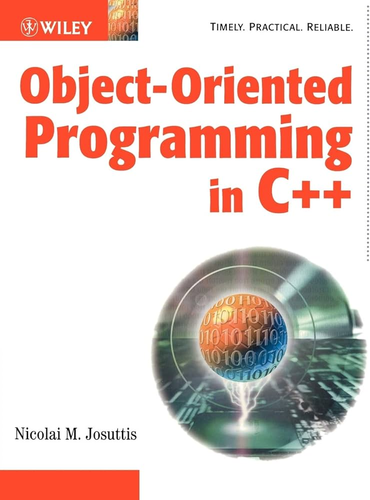

بص يا غالي عارف ان الكلام ممكن تكون حسه سمعته كتير قبل كده بس تعالي معايا واحده واحده اهتم بالحجات الاولانيه ديه علشان كل حاجه ممكن تحسها صعبه ببعد كده هي مجموعه من حجات اساسيه بس 

لو كلام بنسبالك جي بديهي ادخل علي كود المثال اللي تحت في نوتس مهمه وبعد كده خش في اساله اللي بعد كود

#### Object-oriented programming (OOP) is a `programming paradigm` based on the concept of "objects"

بكل بساطه يعني ال oop هي طريقه لكتابة الكود  زي ما كنا بنكتب الكود ففانكشنز زمان دلوقتي بقي عندنا حاجه اسمها Object

object = شئ

يعني مثلا الكتاب ده نقدر نعتبره object 

<p align="center">
  
</p>

نقدر نوصف المعلومات اللي شايفينها في الكتاب زي لون الغلاف مثلا ابيض زي عنوان الكتاب وزي اسم مؤلف الكتاب 

المعلومات دي والداتا دي عندنا بنسميها attributes ولو عايزين نوصل لصفحه معينه في الكتاب فمحتاجين نعمل فانكشن توصلنا ليها والفانكشن في object اسمها method

كده عرفنا ان الاوبجكت بيتكون من حاجتين الداتا اللي بتوصف الاوبجكت او بنخزنها في الاوبجكت (attributes) و شوية ال فانكشنز اللي بتعمل عمليات علي داتا ديه 

## Syntax

علشان تعمل اوبجكت في جافا محتاج الاول تعمل حاجه اسمها class زي تيمبليت كده تمشي عليه 

```java 

class Book {
    // attributes
    String title;
    String coverColor;
    String auther;

    // methods ركز ان الميثود هنا بتشتغل علي الاوبجكت 

    // في ميثوز مشهوره والاكثر استخداما 
    // setter getter
    // هيبان فايدتها قدام


    public String getTitle() {
        return title;
    }

    public void setTitle(String title) {
        this.title = title;
    }

    public String getCoverColor() {
        return coverColor;
    }

    public void setCoverColor(String coverColor) {
        this.coverColor = coverColor;
    }

    public String getAuther() {
        return auther;
    }

    public void setAuther(String auther) {
        this.auther = auther;
    }
}

public class Main {
    public static void main(String[] args) {
        // علشان تعمل اوبجكت جديد من كلاس بتستخدم new
        // object جديد
        // = Instance from Book class
        // you know this
        // int x = 10;
        // Book B1 = new Book();
        // ?? what diff?
        // replaced int by Book
        // نقدر نعتبر ان الكلاس هي داتا تايب احنا اللي بنعملها عايزك تحط في دماغك كده طول محنا شغالين وتربط بين الاتنين
        Book B1 = new Book();
        B1.title = "object orianted programming";
        B1.auther= "Nicolai";
        B1.coverColor = "white";
        //what output?
        System.out.println( B1.getAuther());
        // output = Nicolai
        B1.setAuther("Nicolai M V2");
        //what output?
        System.out.println( B1.getAuther());
        // output = Nicolai M V2
        Book B2 = B1;
        // B2 خزنت ريفرينس B1 
        B2.auther = "Dr Elshimi";
        //what output?
        System.out.println( B1.getAuther());
        // output = Dr Elshimi

    }
}

```
قبل ما تدخل علي اساله عايزك تعرف يعني ايه كونستراكتور 
اتفرج علي فيديو ده 

[Constructor Part 1](https://youtu.be/mfIAAwDbdag?si=RrW1HouA-hzFwsrb)

[Constructor Part 2](https://youtu.be/rrgQ5P1g6Ys?si=I2xnU3tS2H8vVgsE)


### Multiple-Choice Questions

1. **Which of the following best describes a class in OOP?**
   - A. An instance of an object
   - B. A blueprint for creating objects
   - C. A method within an object
   - D. A function that defines the behavior of an object

2. **In OOP, what is an object?**
   - A. A collection of data and methods
   - B. A function within a class
   - C. A type of variable
   - D. A reusable piece of code

3. **What is the correct syntax to create an object named `car` from a class named `Vehicle` in Java?**
   - A. `Vehicle car = new Vehicle();`
   - B. `Vehicle car := new Vehicle();`
   - C. `Vehicle car = Vehicle();`
   - D. `Vehicle car <- new Vehicle();`

4. **Which of the following statements is true about constructors in a class?**
   - A. They can only be called once for each class.
   - B. They initialize the object’s state.
   - C. They are used to destroy objects.
   - D. They cannot take parameters.

5. **Which keyword is used to define a class in Java?**
   - A. `class`
   - B. `def`
   - C. `object`
   - D. `define`

6. **How do you access the attribute `name` of an object `person` in Java?**
   - A. `person.name`
   - B. `person->name`
   - C. `person:name`
   - D. `person[name]`

7. **What is the output of the following code?**
   ```java
   public class MyClass {
       public int value;
       public MyClass(int value) {
           this.value = value;
       }
   }

   public class Main {
       public static void main(String[] args) {
           MyClass obj = new MyClass(10);
           System.out.println(obj.value);
       }
   }
   ```
   - A. `value`
   - B. `10`
   - C. `0`
   - D. `MyClass`

8. **Which of the following methods is automatically called when an object is created?**
   - A. `__new__`
   - B. `__create__`
   - C. `__init__`
   - D. `constructor`

9. **What is the purpose of the `this` keyword in methods of a class in Java?**
   - A. It refers to the class itself.
   - B. It is used to define class variables.
   - C. It refers to the instance of the class.
   - D. It is a keyword for defining private methods.

10. **Which of the following is true about class variables and instance variables?**
    - A. Class variables are shared among all instances, while instance variables are unique to each instance.
    - B. Instance variables are shared among all instances, while class variables are unique to each instance.
    - C. Both class and instance variables are shared among all instances.
    - D. Neither class nor instance variables are shared among instances.

11. **What does the following Java code define?**
    ```java
    public class Animal {
    }
    ```
    - A. An abstract class
    - B. An empty class
    - C. A class with one method
    - D. A class with one attribute

12. **How do you create an instance method in Java?**
    - A. By defining a function inside a class
    - B. By defining a function outside a class
    - C. By using the `@staticmethod` annotation
    - D. By using the `@classmethod` annotation

13. **What is the output of the following code?**
    ```java
    public class Test {
        public int x;
        public Test(int x) {
            this.x = x;
        }
    }

    public class Main {
        public static void main(String[] args) {
            Test t1 = new Test(5);
            Test t2 = new Test(10);
            System.out.println(t1.x + " " + t2.x);
        }
    }
    ```
    - A. `5 5`
    - B. `10 10`
    - C. `5 10`
    - D. `10 5`

14. **What will happen if you try to call a method that doesn't exist on an object in Java?**
    - A. It will call a default method.
    - B. It will return `null`.
    - C. It will raise a `NoSuchMethodError`.
    - D. It will silently fail.

15. **Which of the following statements is true about the `toString` method in Java?**
    - A. It is used to convert a string to an integer.
    - B. It is called when the object is destroyed.
    - C. It is called when the `System.out.println` function is used on an object.
    - D. It is used to initialize an object.

### Answers

```markdown
1. B
2. A
3. A
4. B
5. A
6. A
7. B
8. D
9. C
10. A
11. B
12. A
13. C
14. C
15. C
```

more mcq 

### Multiple-Choice Questions

1. **What is the primary purpose of a constructor in Java?**
    - A) To allocate memory for objects
    - B) To perform clean-up before object deletion
    - C) To initialize the state of an object
    - D) To define methods for an object
    - **Solution:** C) To initialize the state of an object

2. **Which of the following is true about constructor overloading in Java?**
    - A) Constructors cannot be overloaded
    - B) Overloaded constructors must have the same number of parameters
    - C) Overloaded constructors must have different parameter lists
    - D) Overloaded constructors must have different return types
    - **Solution:** C) Overloaded constructors must have different parameter lists

3. **What will happen if a class has no constructor defined explicitly?**
    - A) The program will not compile
    - B) The class will use the constructor of its superclass
    - C) Java provides a default no-argument constructor
    - D) The class cannot be instantiated
    - **Solution:** C) Java provides a default no-argument constructor

4. **Which of the following statements is true about the `super()` call in a constructor?**
    - A) It calls the constructor of the current class
    - B) It calls the constructor of the superclass
    - C) It calls a static method in the superclass
    - D) It is used to access static variables in the superclass
    - **Solution:** B) It calls the constructor of the superclass

5. **What is the output of the following code?**
    ```java
    public class Test {
        int x;
        Test(int x) {
            this.x = x;
        }
    }

    public class Main {
        public static void main(String[] args) {
            Test obj = new Test(5);
            System.out.println(obj.x);
        }
    }
    ```
    - A) `0`
    - B) `5`
    - C) Compilation error
    - D) Runtime error
    - **Solution:** B) `5`

6. **What is a constructor's return type in Java?**
    - A) `void`
    - B) `int`
    - C) The same type as the class
    - D) Constructors do not have a return type
    - **Solution:** D) Constructors do not have a return type

7. **What will be the result of compiling and running the following code?**
    ```java
    public class Example {
        int x;
        Example(int x) {
            x = x;
        }

        public static void main(String[] args) {
            Example obj = new Example(10);
            System.out.println(obj.x);
        }
    }
    ```
    - A) `0`
    - B) `10`
    - C) Compilation error
    - D) Runtime error
    - **Solution:** A) `0`

8. **Which of the following is true about the usage of `this` keyword in a constructor?**
    
    - B) It can be used to call another constructor in the same class
    - C) It can be used to access static variables
    - D) It can be used to override a constructor
    - **Solution:** B) It can be used to call another constructor in the same class

9. **What is the output of the following code?**
    ```java
    public class Test {
        int x;
        Test() {
            x = 5;
        }

        Test(int val) {
            x = val;
        }
    }

    public class Main {
        public static void main(String[] args) {
            Test obj1 = new Test();
            Test obj2 = new Test(10);
            System.out.println(obj1.x + " " + obj2.x);
        }
    }
    ```
    - A) `0 10`
    - B) `5 10`
    - C) `5 0`
    - D) Compilation error
    - **Solution:** B) `5 10`

10. **Why might you define a private constructor in a class?**
    - A) To allow inheritance
    - B) To prevent the class from being instantiated from outside the class
    - C) To define a utility class
    - D) To override methods
    - **Solution:** B) To prevent the class from being instantiated from outside the class


    قبل ما تدخل علي اساله عايزك تعرف يعني ايه static 
اتفرج علي فيديو ده 

static block dr Eman بتركز عليه

[static Part 1](https://youtu.be/7DbGHC8rF14?si=EmyzviIdC6nsa20m)

[static Block Part 2](https://youtu.be/3n47zkGMIxc?si=6hrRwQVmPU2odS5L)

1. What does the keyword "static" signify in Java?
   - a) It is used to define static methods.
   - b) It is used to define a class member that belongs to the class itself.
   - c) It is used to allocate memory for an object.
   - d) It is used to declare a constant.

**Answer:** b) It is used to define a class member that belongs to the class itself.

2. Which of the following statements about static variables is true?
   - a) Static variables are initialized when the object is created.
   - b) Static variables are shared among all instances of the class.
   - c) Static variables cannot be accessed outside the class.
   - d) Static variables cannot be modified.

**Answer:** b) Static variables are shared among all instances of the class.

3. What is the purpose of a static block in Java?
   - a) To create new objects.
   - b) To initialize static variables.
   - c) To execute code only once when the class is loaded.
   - d) To handle exceptions in static methods.

**Answer:** c) To execute code only once when the class is loaded.

4. Can static methods access non-static variables directly?
   - a) Yes
   - b) No

**Answer:** b) No

5. Which keyword is used to prevent inheritance of a class in Java?
   - a) final
   - b) static
   - c) abstract
   - d) private

**Answer:** a) final

6. What happens if a static method is called using a null reference?
   - a) It results in a compilation error.
   - b) It results in a runtime exception.
   - c) It executes normally.
   - d) It depends on the implementation of the method.

**Answer:** c) It executes normally.

7. How many times is a static block executed in Java?
   - a) Every time an object of the class is created.
   - b) Only once when the class is loaded.
   - c) Every time a static method is called.
   - d) It depends on the JVM implementation.

**Answer:** b) Only once when the class is loaded.


11. What is the significance of the "static" keyword in the context of nested classes?
    - a) It allows access to outer class members.
    - b) It restricts access to outer class members.
    - c) It denotes that the nested class is static.
    - d) It allows multiple instances of the nested class.

**Answer:** c) It denotes that the nested class is static.

12. Which of the following statements is true regarding static blocks?
    - a) They are executed every time an object of the class is created.
    - b) They can directly access non-static members of the class.
    - c) They can be used to perform operations that should be done before any object creation.
    - d) They can be placed anywhere in the class.

**Answer:** c) They can be used to perform operations that should be done before any object creation.

13. Can static methods be overridden in Java?
    - a) Yes
    - b) No

**Answer:** b) No

14. Which of the following is not a valid use of static keyword?
    - a) Static variable
    - b) Static block
    - c) Static constructor
    - d) Static method

**Answer:** c) Static constructor

15. What is the default value of a static integer variable in a class?
    - a) 0
    - b) 1
    - c) null
    - d) Depends on the data type

**Answer:** a) 0


# default values of data types in java

<p align="center">
  
</p>

Passing Objects to Methods (by Value vs by Reference)

[Part 1](https://youtu.be/nDc83B16Baw?si=zm8SsprdKz25PiHs)

[Part 2](https://youtu.be/b2vYxHhkBiw?si=lVpBdm5iKpDk-f5E)

1. Which of the following statements is true regarding passing objects to methods in Java?
   - a) Objects are always passed by value.
   - b) Objects are always passed by reference.
   - c) Primitive data types are always passed by reference.
   - d) Primitive data types are always passed by value.

**Answer:** a) Objects are always passed by value.

2. In Java, when an object is passed to a method, what is actually passed?
   - a) The object's reference/address
   - b) The object's data values
   - c) Both the reference and the data values
   - d) None of the above

**Answer:** a) The object's reference/address

4. In Java, what happens if a method modifies the attributes of an object passed as an argument?
   - a) The changes are reflected in the original object.
   - b) The changes are lost after the method execution.
   - c) It results in a compilation error.
   - d) It throws a runtime exception.

**Answer:** a) The changes are reflected in the original object.

5. Which keyword is used to pass an object by reference in Java?
   - a) final
   - b) this
   - c) volatile
   - d) There is no keyword to pass objects by reference.

**Answer:** d) There is no keyword to pass objects by reference.


# Question 1
```java
class Demo {
    static int num;
    static String str;

    static {
        // What values should be assigned to 'num' and 'str' here
    }
}

```

Answer:

num should be assigned the default value for an int, which is 0.
str should be assigned null, which is the default value for a String

# Question 2
```java
public class MyClass {
    private int x;
    private int y;
    private static int count;

    public MyClass(int x) {
        // How would you use 'this' keyword to assign value to 'x'
        // and increment the 'count' for every object created?
    }

    // Assuming there is another constructor
    public MyClass(int x, int y) {
        // How would you invoke the first constructor and assign value to 'y'?
    }
}
```

answer

```java
public class MyClass {
    private int x;
    private int y;
    private static int count;

    public MyClass(int x) {
        // How would you use 'this' keyword to assign value to 'x'
        // and increment the 'count' for every object created?
        this.x = x;
        count++;
    }

    // Assuming there is another constructor
    public MyClass(int x, int y) {
        // How would you invoke the first constructor and assign value to 'y'?
        this(x); // Invoking the first constructor
        this.y = y;
    }
}
```

# Question 3
```java
public class Container {
    int value;

    public Container(int value) {
        this.value = value;
    }

    // What changes should be made to the method below to ensure that
    // the original 'Container' object's 'value' is modified?
    public static void updateValue(Container c, int newValue) {
        // Code to update 'value'
    }
}
```
answer

```java
public class Container {
    int value;

    public Container(int value) {
        this.value = value;
    }

    // What changes should be made to the method below to ensure that
    // the original 'Container' object's 'value' is modified?
    public static void updateValue(Container c, int newValue) {
        // Code to update 'value'
        c.value = newValue; // Modify the original 'Container' object
    }
}

```

